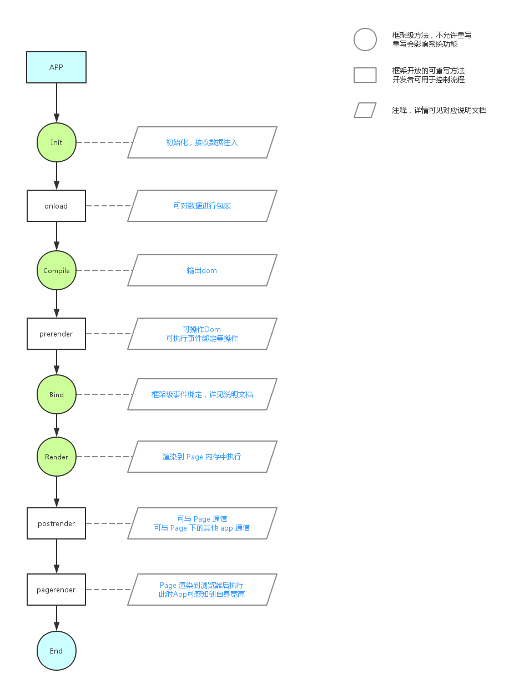

# App
[Aimeejs](https://github.com/gavinning/aimee)
可以基于此创建Widget App

### Create
创建一个app
```sh
$ aimee c -w footer
# or
$ aimee create -w footer

# 创建es6模板
$ aimee c -ew footer
$ aimee create -ew footer
```

### Install
从仓库安装一个app
```sh
$ aimee i app
# or
$ aimee install app
```

### Remove
```sh
$ aimee r app
# or
$ aimee remove app
```

### Update
```sh
$ aimee u app
# or
$ aimee update app
```

### Widget App
以当前App为父类创建的app，具有统一接口，方便被支持的框架所调用
```js
import App from 'app';
import template from 'footer.jade';

class Footer extends App {

    constructor() {
        super();
        this.template = template;
    }

    onload() {
        var data = this.getData()
    }

    // app渲染到页面之前执行，用于预处理渲染内容
    prerender(app) {

        // this === app
        console.log(this === app) // => true

        // app为模块的实例
        app.find('li').eq(0).addClass('selected');

        this.bind({

            // 为app根对象绑定事件
            'click': () => {
                console.log('click app')
            },

            // 为app下的li绑定事件
            'click@li': () => {
                console.log('click li')
            },

            // 多事件绑定
            'click, focus@input[type="text"]': () => {
                console.log('click or focus input[type="text"]')
            }
        })
    }

    // app渲染到页面之后执行，此时app还在内存中，不能获取宽度高度等与尺寸相关的属性
    postrender(app) {
        // app为模块的实例
    }

    // 页面渲染到浏览器后执行，此时可以获取宽高等与尺寸相关的属性
    pagerender(app) {
        // some code
    }
}

export defaut Footer;
```

### Normal App
任意你熟悉的方式，可以是一个css文件，可以是js功能文件，也可以是一段jade模板  
```js
// eg 1
// 自启动，注册即执行，不需要对外暴露接口
// 构建工具UZ会对js模块进行包装，所有变量定义都将是局部变量，所以不用担心变量污染全局
var innerWdith = window.innerWdith;
console.log(innerWdith)
```

对外开放接口请使用```exports.test = test``` 或 ```module.exports = test```
```js
// eg 2
// 需要对外暴露接口
var innerWdith = window.innerWdith;
var foo = {
    bar: function(){
        console.log(innerWdith)
    }
}
module.exports = foo;
```

```js
// eg 3
// 需要对外暴露接口
exports.foo = function(){
    console.log('foo')
}

exports.bar = function(){
    console.log('bar')
}
```


### Use App
```js
import App from 'app';

let app = new App;
app.foo();
```

App工作流程
---

