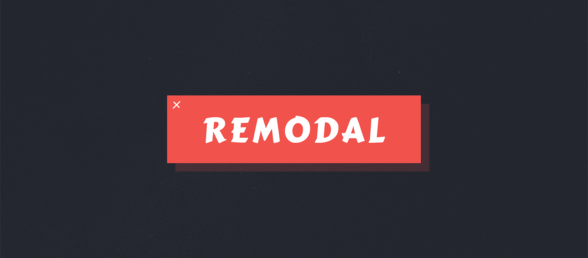

# Remodal
很棒的弹出层插件，封装自
[Remodal](https://github.com/VodkaBears/Remodal)
[Homepage](http://vodkabears.github.io/remodal/)
版权归原作者所有



### Install
```sh
aimee i remodal --save
```

### Docs
[Remodal](https://github.com/VodkaBears/Remodal)

### Usage
```js
// init.js
aimee
    .reg('jquery')
    .reg('remodal');
```
```js
var inst = $('[data-remodal-id=modal]').remodal();

/**
 * Opens the modal window
 */
inst.open();

/**
 * Closes the modal window
 */
inst.close();

/**
 * Returns a current state of the modal
 * @returns {'closed'|'closing'|'opened'|'opening'}
 */
inst.getState();

/**
 * Destroys the modal window
 */
inst.destroy();
```

### Events
```js
$(document).on('opening', '.remodal', function () {
  console.log('Modal is opening');
});

$(document).on('opened', '.remodal', function () {
  console.log('Modal is opened');
});

$(document).on('closing', '.remodal', function (e) {

  // Reason: 'confirmation', 'cancellation'
  console.log('Modal is closing' + (e.reason ? ', reason: ' + e.reason : ''));
});

$(document).on('closed', '.remodal', function (e) {

  // Reason: 'confirmation', 'cancellation'
  console.log('Modal is closed' + (e.reason ? ', reason: ' + e.reason : ''));
});

$(document).on('confirmation', '.remodal', function () {
  console.log('Confirmation button is clicked');
});

$(document).on('cancellation', '.remodal', function () {
  console.log('Cancel button is clicked');
});
```
